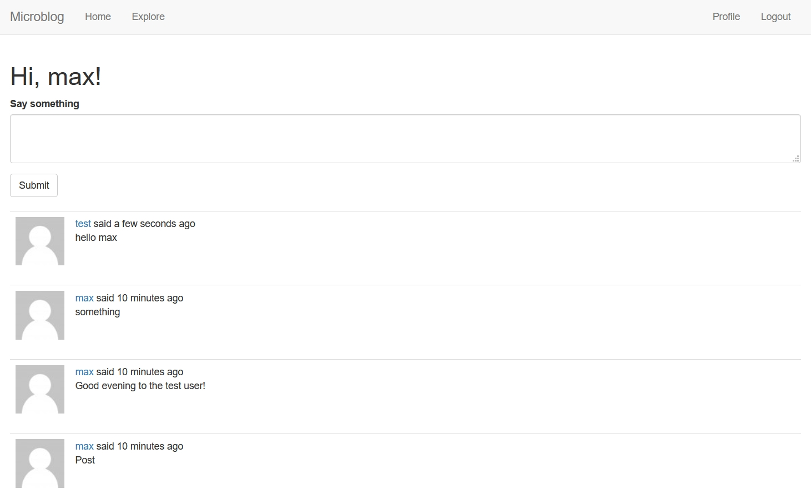

## Setup instructions:

* Create a Python environment and install the required packages:
```
pip install -r requirements.txt
```
* Initialize the database with command:
```
flask db init
```
* Run the application!
```
flask run
```
* In debug mode:
```
set FLASK_DEBUG=1
flask run
```


## Interface

### Signing in:
Enter username and password to sign in. Can also register or reset the existing password with an email.


### Homepage:
The user can post text messages on this page as well as browse own posts and posts on the followed pages. The "Explore" tab lets the user see all new posts by all users.



### User profile:
The user page displays all posts by the user and allows to follow/unfollow if the user page does not belong to the one logged in. The user can also edit his username and bio.

